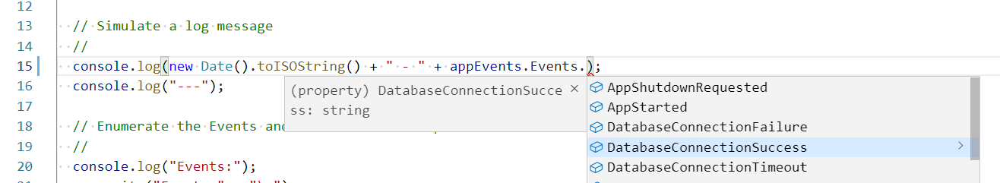

# Event-based logging

Event-based logging helps to clarify operability of software systems. This repo has examples and principles.

> Copyright © 2018-2020 [Conflux](https://confluxdigital.net/) - Licenced under [CC BY-SA 4.0](https://creativecommons.org/licenses/by-sa/4.0/) 

## Definition

> Event-based logging uses compile-time `enum`-based event definitions when logging to make runtime diagnosis and team-member onboarding clearer and easier. 

## Principles

Event-based logging is designed to be a simple, expressive approach to exploring failure modes and real-world operational behaviour for all kinds of software.

1. Have a single, definitive list of application events in code
2. Use exactly one of these event codes in the log message when logging
3. Use an `enum` type or equivalent for compile-time checking of uniqueness and searchability
4. Get code-completion from the IDE or REPL when choosing an event to log
5. Simple SHIFT-select or double-click on an event name to copy/paste into a log search tool - no manual selection of multiple words for copy/paste
6. ...

## Examples

A key aim is to "lean on the compiler" for compile-time verification of the Event types when logging. This in turn means we get code-completion when choosing an Event type during logging:

```JavaScript

// Nodejs example for event-based logging

const Events = Object.freeze({
    UndefinedError : 'UndefinedError',
    FailedToConnectToDatabase : 'FailedToConnectToDatabase',
    UnexpectedTokenInParseStream : 'UnexpectedTokenInParseStream',
  });
  
  // console.log(Events.Fai --> auto-complete 

```



More detailed examples:

* C#: [CSharp-example.cs](examples/cs/EventBasedLoggingExample/CSharp-example.cs)
* NodeJS: [NodeJS-example.js](examples/js/NodeJS-example.js)
